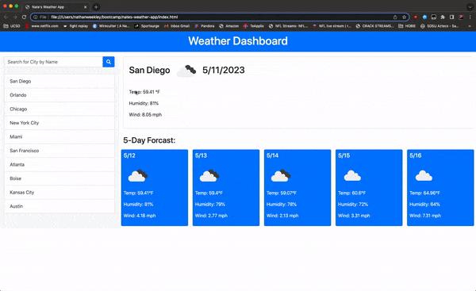

# Nate's Weather App
> Create a weather app using Json and API keys.
> Must have a search function (Search by City Name).
> Must display array of last 10 City searches, and store them to local storage.
> Must use openweathermap and get an API key from them.
> Must also query openweathermap's forecast parameter.
> Display a future 5 day forcast for current selected city.
> Include Tempurate, Humidity and Wind.
> Use icons from openweathermap.
> Live demo: 

---
## Table of Contents
* [General Info](#general-information)
* [Technologies Used](#technologies-used)
* [Features](#features)
* [Screenshots](#screenshots)
* [Usage](#usage)
* [Project Status](#project-status)
* [Room for Improvement](#room-for-improvement)
* [Acknowledgements](#acknowledgements)
* [Resources](#resources)
* [License](#resources)

---
## General Information
- Create a weather app that shows not only current weather for user entered City, but also a 5 day future forcast.
- Purpose is to put into practice API useage for geocoding with [openweathermap](https://openweathermap.org/api/geocoding-api).
- Undertaken because I need experience using API keys and implimenting them.

---
## Technologies Used
-  
- 
-  

---
## Features
- Upon page load, display the weather for the last searched city saved to local storage.
- Save the latitude and longitude information for each city.
- Save up to the last 10 searched cities using [JSON](https://www.json.org/json-en.html).
- Remove additional citys for displayed list >10.
- Uses openweathermap API to display [Icons](https://openweathermap.org/weather-conditions) that correspond to the weather situation IE: Cloudy, Rain, ect..

---
## Screenshots

---
## Usage
To display a user searched citys' current weather as well as a 5-day forcast.

---
## Project Status

---
## Room for Improvement
- Add additional parameters such as UV Index.
- Extend the forcast from 5 days to a full week.
- Display current time for each city using [Day.js](https://day.js.org).

To do:
- All current required tasks completed.

---
## Acknowledgements
- This project was inspired by YouTube channel: [Web Dev Simplified](https://www.youtube.com/watch?v=w0VEOghdMpQ).

---
## Resources
- 
- 
- 
- 
- 

---
##  License
This project is [MIT](https://opensource.org/licenses/MIT) licensed.  © 2023 [Nathan Weekley](mailto:nweekley27@gmail.com) 

---

 

